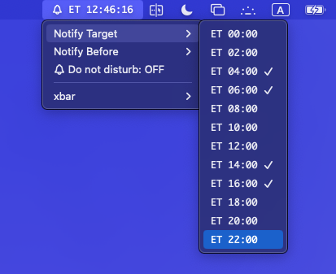

# xbar-eorzea-time-plugin

A plugin for [xbar](https://xbar.com) to show Final Fantasy XIV in game clock (Eorzea Time / ET).



- show Eorzea Time in menu bar
- notify at selected Eorzea Time with selected lead time
- set Do Not Disturb (DND)

doesn't support [SwiftBar](https://swiftbar.app/) currently.

## How to use

1. copy `dist/eorzea-time.1s.mjs` to plugin directory
2. add execution permission `chmod +x eorzea-time.1s.mjs`

This plugin uses sf-symbols so download/install from [here](https://developer.apple.com/sf-symbols/) or below command.

```sh
brew install sf-symbols
```
